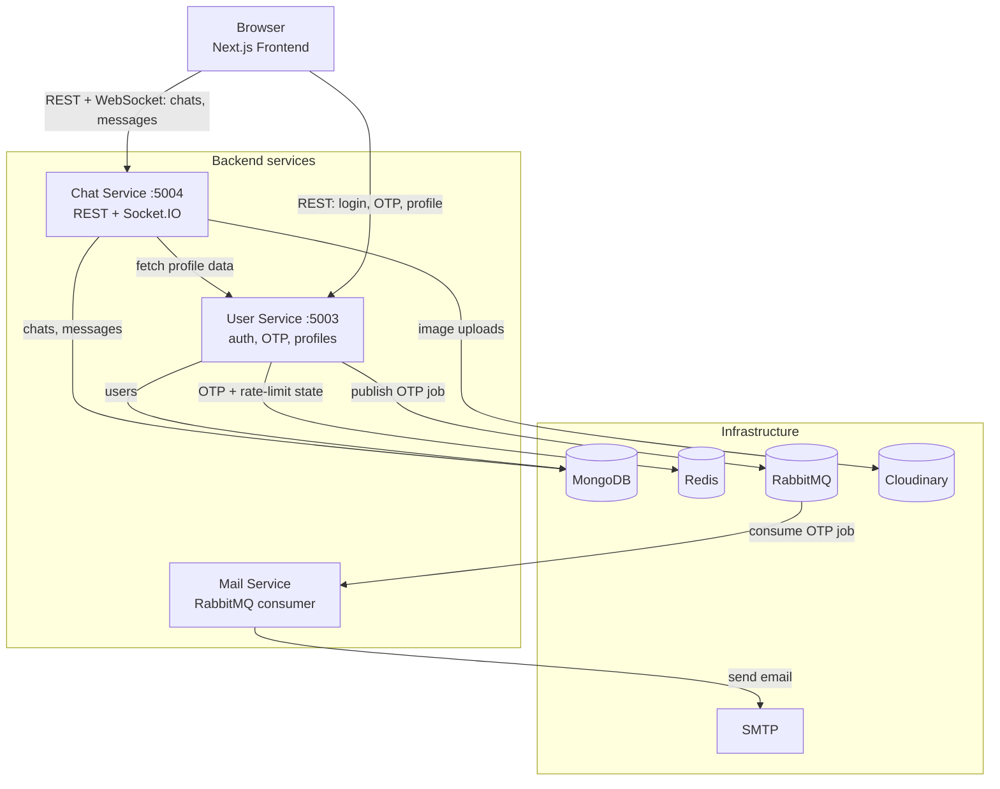

# ChatApp

A real-time messaging platform built as a microservices system: a Next.js frontend talking to three independent backend services (auth, chat, mail) coordinated over MongoDB, Redis, and RabbitMQ, with WebSocket-based live messaging via Socket.IO.


## Live demo

**[chatapp on Railway](https://chatapp-sp.up.railway.app)** — the frontend, all three backend services, and Socket.IO are deployed and running for real (MongoDB Atlas, Upstash Redis, CloudAMQP).

Login is passwordless (email OTP), so to let anyone try it without needing a real inbox, there are two demo accounts with fixed codes instead of randomly emailed ones — log into both (e.g. one in a normal window, one in an incognito window) to try real-time messaging between them:

| Email | OTP |
|---|---|
| `demo@chatapp.dev` | `123456` |
| `demo2@chatapp.dev` | `654321` |

They already have a chat going with a few messages, so there's history to see immediately. Every other email goes through the real flow (random OTP, actually emailed).

## Why microservices, here

This is a small app — a single Express server could easily hold auth, chat, and mail. I split it into three services anyway, on purpose, to work through the problems that split actually creates: services need to authenticate each other's tokens without sharing a database, one service calling another over HTTP needs to handle that call failing gracefully, and a WebSocket gateway needs its own authentication story separate from the REST API's. Those are the problems this repo is set up to demonstrate solving, not to pretend this traffic volume needs four deployables.

## Architecture



Each service owns its own concerns: the user service is the only thing that touches the `User` collection and issues JWTs; the chat service verifies those same JWTs independently (shared secret, no shared session store) and calls the user service over plain HTTP when it needs profile data to attach to a chat. The mail service never talks to a database or the other services directly — it only consumes jobs off a queue, so a slow or failing SMTP provider can't back up login requests.

## Features

- Passwordless auth via one-time email codes (Redis-backed expiry, rate-limited)
- Real-time 1:1 messaging with typing indicators, online presence, and read receipts
- Image sharing in chat (Cloudinary-backed uploads)
- Cursor-based infinite scroll for message history; paginated chat list
- Dark, custom-themed UI (Tailwind v4, no default-palette look)

## Engineering highlights

Things that are easy to skip in a portfolio project and deliberately aren't skipped here:

- **WebSocket auth, not just REST auth** — the Socket.IO handshake verifies the same JWT the REST API uses, and a socket can't join a chat room it isn't a participant in. It's common for the realtime layer of a chat app to quietly trust whatever `userId` the client hands it; this one doesn't.
- **Input validation at the boundary** — every request body and route param is validated with Zod before it reaches a controller, with 400s carrying structured field-level errors.
- **Layered rate limiting** — a general per-IP limiter on every service, a stricter one on the auth endpoints, and a Redis-backed per-email attempt counter on OTP verification specifically (so the general limiter alone can't be relied on to stop OTP brute-forcing).
- **CORS as an allowlist, not a wildcard** — including on the Socket.IO handshake, which is easy to forget since it's configured separately from Express's own CORS middleware.
- **No internals leak into error responses** — exceptions are logged in full server-side and returned to the client as a generic message, gated behind `NODE_ENV` for local debugging.
- **Security headers via Helmet**, tuned rather than defaulted — see the HSTS story below.
- **Strict TypeScript** across all three backend services and the frontend.
- **One-command local environment** — `docker compose up` brings up MongoDB, Redis, RabbitMQ, and all four app services with health-checked startup ordering.

## Challenges I ran into (and what they taught me)

These are real issues found and fixed during this project's development, not hypotheticals.

**The realtime layer had no authentication.** The Socket.IO connection was originally trusting a client-supplied `userId` in the handshake query with zero verification — meaning anyone could connect claiming to be any user and receive their online-status updates, or join any chat room by ID and read its messages. REST endpoints were properly guarded; the WebSocket gateway, configured separately, wasn't. Fixed by verifying the JWT during the handshake and checking chat membership before allowing a room join. The lesson: a second transport is a second attack surface, not covered by the first one's auth.

**A security header broke local development.** Adding `helmet()` for security headers seemed like a pure improvement — until Chrome, which treats `localhost` as an inherently trustworthy origin, took the default `Strict-Transport-Security` header at face value and silently force-upgraded every subsequent request to HTTPS. Since these services only ever serve plain HTTP, every request after the first started failing with no useful error message client-side. Traced it by inspecting actual network requests in a live browser session, not from the stack trace (there wasn't one — the connection just failed). Fixed by disabling HSTS on these services directly; that header belongs on a TLS-terminating reverse proxy in front of them, not on a plain-HTTP app server.

**A scroll bug that only showed up with real interaction.** After adding cursor-based pagination for message history with an infinite-scroll trigger, opening a chat would sometimes leave the message view stranded mid-conversation instead of at the latest message. The cause: the initial scroll-to-bottom was animated, and the scroll listener watching for "user scrolled near the top → load older messages" was reading the transient low `scrollTop` values the animation passed through on its way up, misreading them as genuine user intent, and firing a fetch that repositioned the view based on that stale read. It never showed up in a type-check or a unit test — only in a real browser, scrolling a real conversation. Fixed by making the first scroll-to-bottom per chat instant instead of animated, closing the window where that race could happen.

**A dependency that "worked" until the environment stopped being forgiving.** None of the three backend services listed `typescript` in `package.json` — the build only ever succeeded locally because of a global install on the dev machine. Invisible until a clean Docker build hit `tsc: not found`. A good reminder that "it works on my machine" is sometimes literally the whole explanation.

**A filename-casing bug macOS was hiding.** One component file was tracked in git with different casing (`verifyOtp.tsx`) than the actual file and its import statement (`VerifyOtp.tsx`) used. macOS's case-insensitive filesystem papers over the mismatch completely — but a fresh clone on any case-sensitive filesystem (which is to say, virtually any Linux CI runner or deploy target) would fail to resolve that import. Found by inspecting `git ls-files` directly, not by anything failing locally.

**Deploying surfaced a platform limitation no amount of local testing would have caught.** OTP email worked in every environment I'd tested — local, Docker Compose — then failed on Railway with a bare `ETIMEDOUT`. The first log line pointed at an IPv6 address (`ENETUNREACH ...:465`), which looked like a DNS-resolution-order bug, so I fixed that (`dns.setDefaultResultOrder('ipv4first')`) and redeployed. It failed again, this time over IPv4, ruling that theory out and pointing at something more fundamental: Railway, like most PaaS providers, blocks outbound SMTP ports by default as an anti-abuse measure, which no amount of code-level fixing was going to work around. Rather than switch to an HTTP-based email API mid-task, I scoped a smaller fix: a designated demo account with a fixed, published OTP that skips the email queue entirely, so the deployed app stays usable while the real fix is a clearly-documented follow-up rather than a silent gap.

## Tech stack

| Layer | Technology |
|---|---|
| Frontend | Next.js 16 (App Router), React 19, TypeScript, Tailwind CSS v4, Socket.IO client |
| User service | Express, MongoDB (Mongoose), Redis, JWT, Zod, Helmet |
| Chat service | Express, Socket.IO, MongoDB (Mongoose), Cloudinary, Multer, Zod, Helmet |
| Mail service | Express, Nodemailer, RabbitMQ consumer |
| Infrastructure | MongoDB, Redis, RabbitMQ, Docker Compose |

## Getting started

Requires Docker and Docker Compose.

```bash
git clone https://github.com/spal45/Chat_App.git
cd Chat_App

cp .env.example .env
cp backend/chat/.env.example backend/chat/.env   # fill in Cloudinary credentials
cp backend/mail/.env.example backend/mail/.env   # fill in SMTP credentials

docker compose up --build
```

Then open `http://localhost:3000`. Login is passwordless — enter any email and a 6-digit code is sent to it (via the SMTP credentials configured above).

Each service's `.env.example` documents exactly which variables it needs and which ones are supplied automatically by Docker Compose vs. required for local (non-Docker) runs.

## Project structure

```
frontend/            Next.js app (App Router)
backend/
  user/               Auth, OTP, user profiles (:5003)
  chat/               Chats, messages, Socket.IO gateway (:5004)
  mail/               RabbitMQ consumer -> SMTP
docker-compose.yml    Full local stack: infra + all 4 services
```

## What's next

Documented honestly rather than left implicit:

- **No automated test suite yet.** The auth flow, chat-membership checks, and the pagination logic above are exactly the kind of thing worth covering first.
- **No CI pipeline yet.** Would have caught the missing `typescript` dependency automatically instead of requiring a manual Docker build to surface it.
- **Socket state is single-instance.** The online-user map lives in the chat service's memory, which is fine for one instance and wouldn't survive horizontally scaling it — that would need to move to Redis pub/sub.
- **Real (non-demo) OTP email doesn't currently work on the live deployment.** Railway blocks outbound SMTP by default (a common anti-abuse policy on PaaS platforms), so Gmail SMTP delivery times out there even though it works locally and in Docker Compose. The fix is to send through an HTTP-based email API (e.g. Resend) instead of raw SMTP — not yet done. The demo account above sidesteps this entirely rather than papering over it.

## License

MIT — see [LICENSE](LICENSE).
